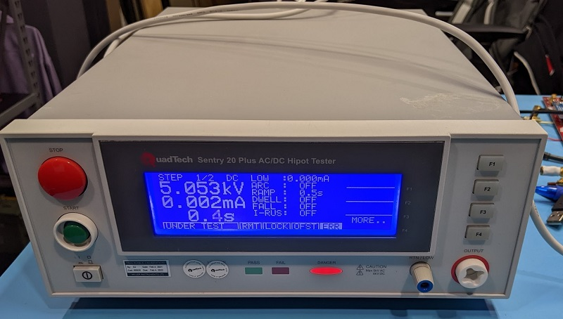
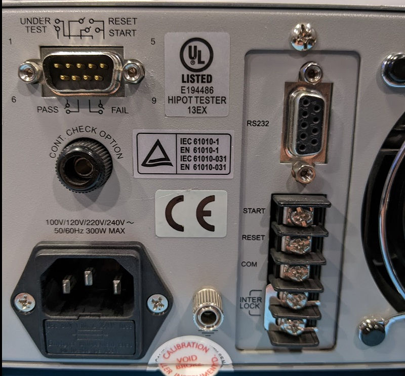

# PyHiPot - Python to RS232 Interface for QuadTech Sentry 20 Plus / Chroma Guardian 19070 HiPot Tester

## Sentry 20 Plus

This project is an API for the Chroma (formally QuadTech) Sentry 19070 (formally Sentry 20/30 Plus) RS232 Python Interface.



Many Sentry 20 Plus units don't have the RS232, but some do. The protocol is described in the user manual for the 19071/19072/19073.
While these are branded differently, they are the same unit it looks like and the interface still works OK.

The RS232 port on the Sentry 20 looks like the following figure, be careful it's *not* the DB9 to the left which just indicates
pass/fail conditions.



## Examples

Start a test, then read the results of the tests (captures multiple steps if programmed):

```python
from hipot.chroma import QuadTechSentry20

s = QuadTechSentry20("/dev/ttyS14")
print(s.identify())
s.start()
data = s.wait_and_return_results()
s.stop()

print(data)
```

Erase programmed steps:

```python
s.clear_steps()
```

Setup a AC test as step #1, 1000V test, 3 second test, 5uA hi limit:

```python
s.set_step_parameter_ac(1, 1000, 0.5, 3, 0.2, 5E-6, 0, 0)
```

See the `chroma.py` for all commands.

## Guardian 19050

The protocol for the Guardian 19050 is different than the one implemented here. The 19050 units have a more standard
SCPI based language which you can find implementations for. The older Sentry 20 Plus / 19070 seem to use a binary
protocol which is non-standard.
